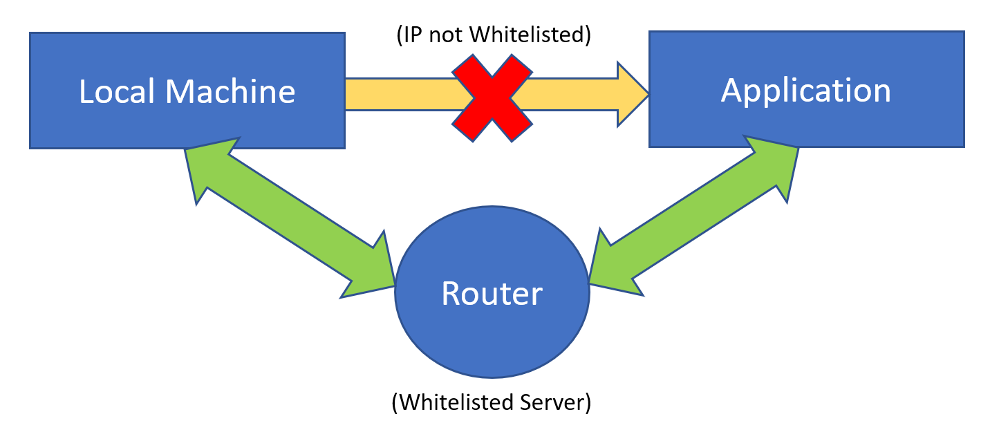
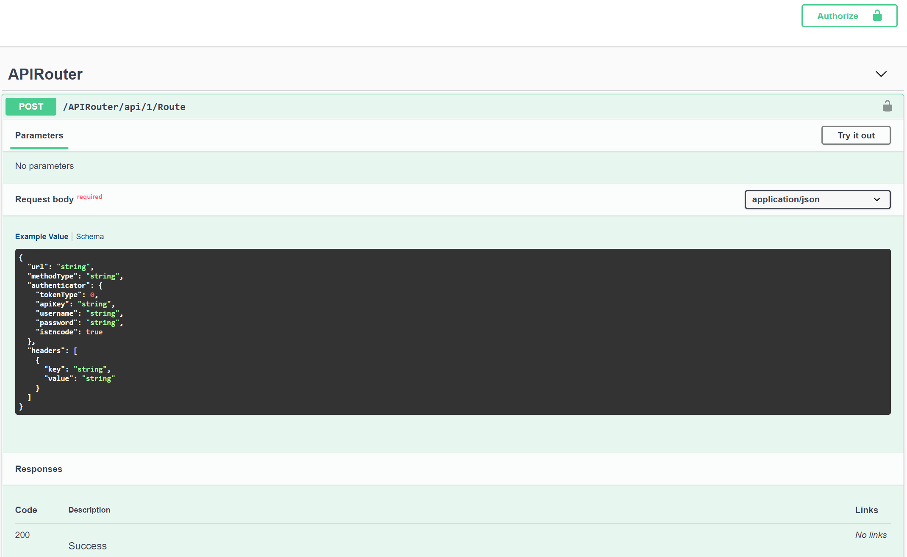

# API Router
- Developed 'Router (WebAPI)' which can be deployed on any server/environment to make API calls.
- Project has inbuilt Swagger support to ease API interaction.
- This will act as a middleware between local environment and 3rd party applications, to communicate with applications which are inaccessible from the local environment but from the Dev/QA server (whitelisted).
- This intermediate layer will make development and debugging process much easier and much faster.
- JSON Web Token (JWT) authentication is set up to secure the application. However a functionality is added to disable authentication based on the config flag.

### <ins>***Application Demo***</ins>:

